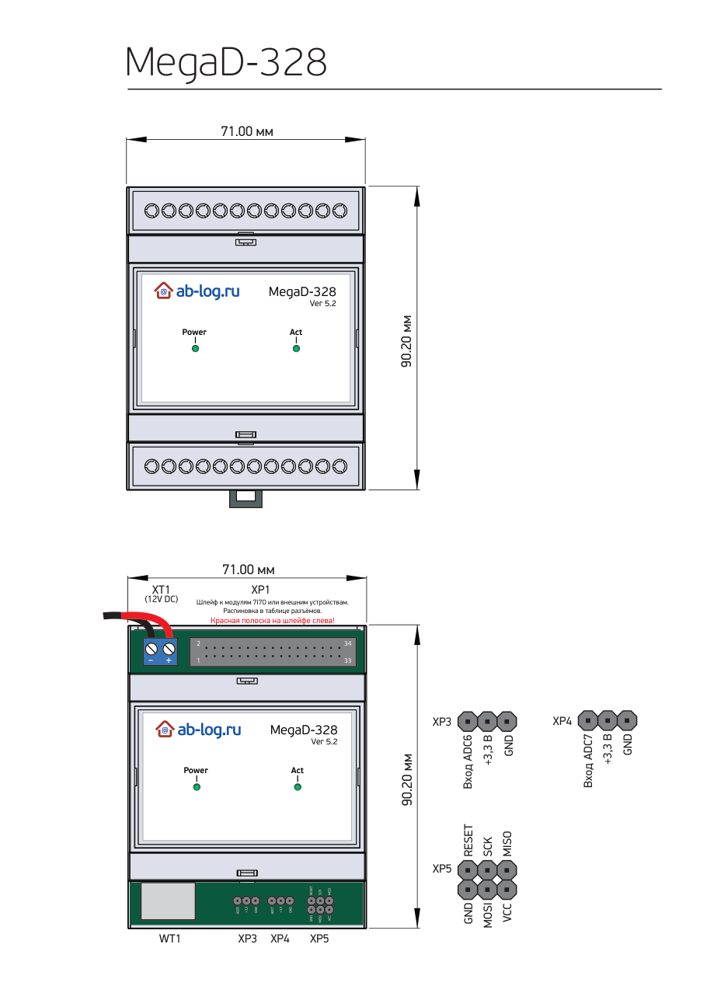
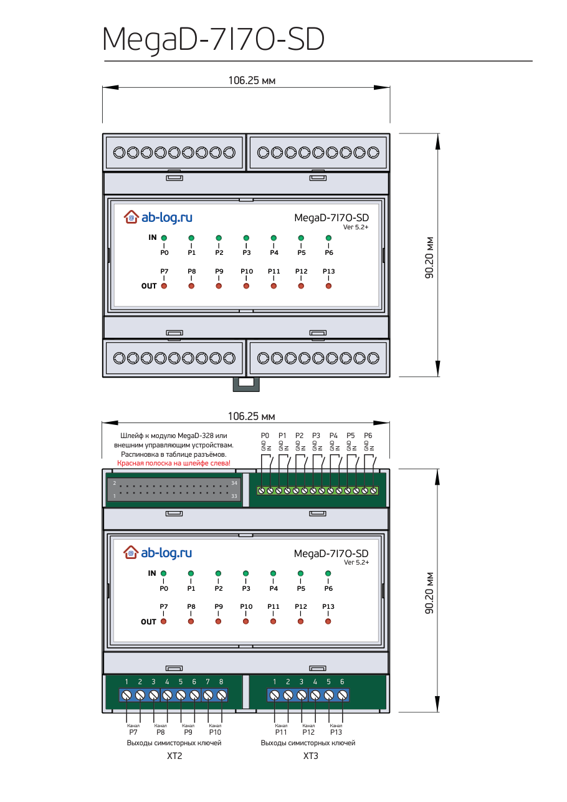
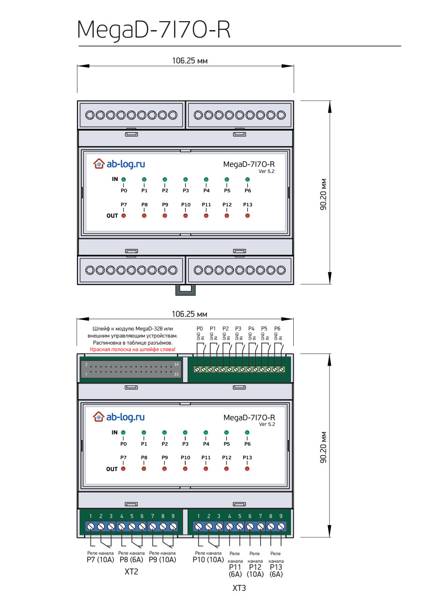
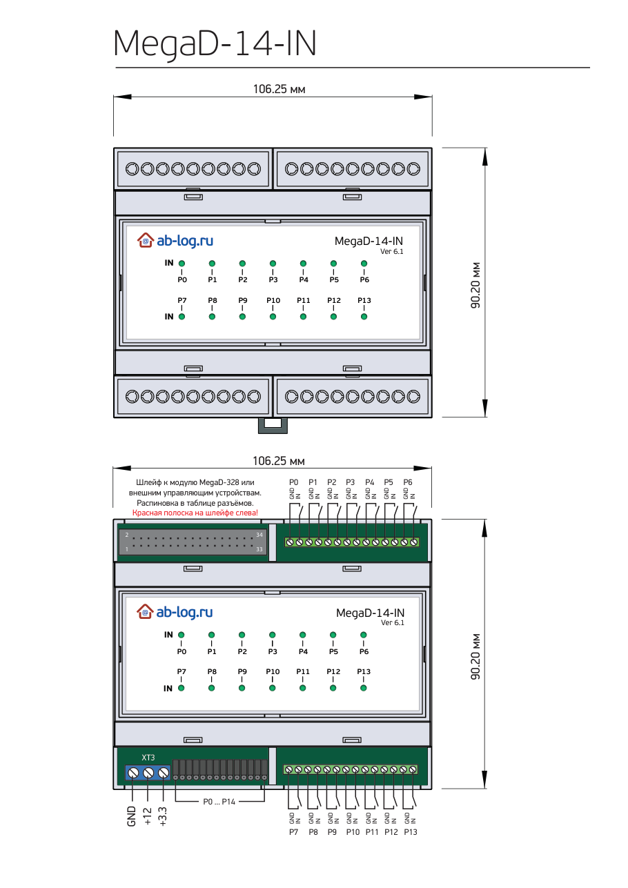
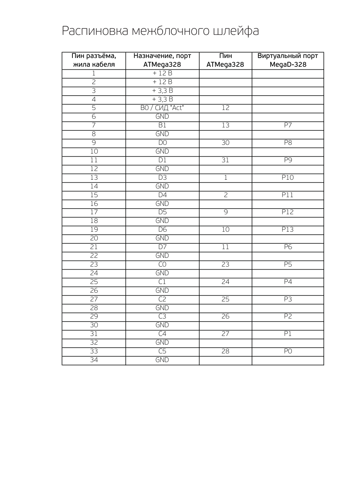
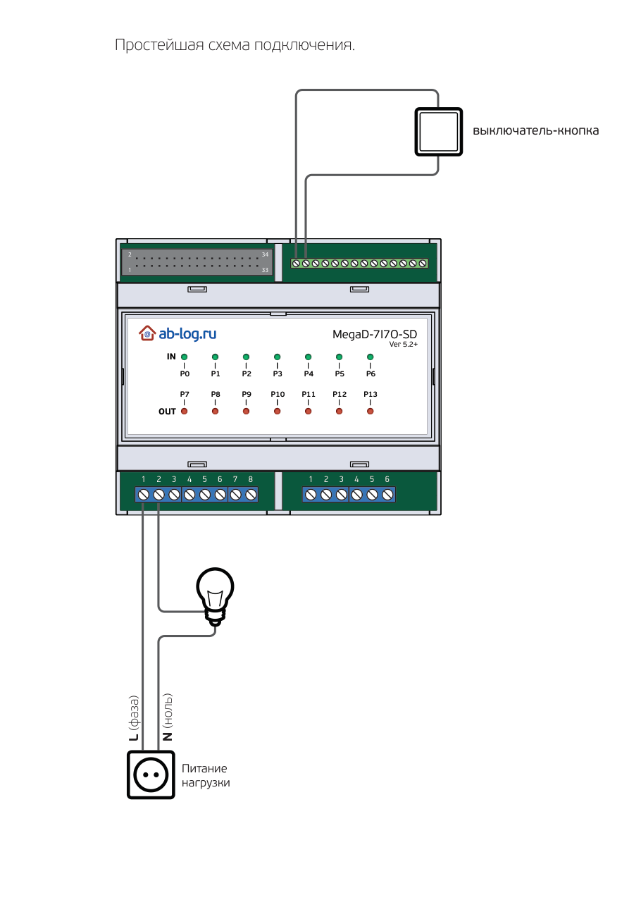

# MegaD-328 / MegaD-7I7O / MegaD-14-IN — документация (rev 5.2+)

> Markdown-версия официального даташита ab-log.ru:
> [mega-d-328-v5-2.pdf](https://www.ab-log.ru/files/File/Datasheets/mega-d-328-v5-2.pdf).
> Текст и таблицы перенесены без изменений, чертежи плат приведены в виде изображений страниц.

Комплект состоит из контроллера **MegaD-328** и исполнительных модулей, которые подключаются к нему
34-жильным шлейфом: **MegaD-7I7O-SD** (7 входов + 7 симисторных выходов), **MegaD-7I7O-R**
(7 входов + 7 релейных выходов) и **MegaD-14-IN** (14 входов).

## MegaD-328

Габариты корпуса: 71,00 × 90,20 мм (крепление на DIN-рейку).

| Разъём | Назначение |
|--------|-----------|
| XT1 | Питание 12 V DC («–» слева, «+» справа) |
| XP1 | 34-пиновый разъём шлейфа к модулям 7I7O / 14-IN или внешним устройствам. **Красная полоска на шлейфе слева!** Распиновка — в таблице ниже |
| XP3 | Вход ADC6, +3,3 В, GND |
| XP4 | Вход ADC7, +3,3 В, GND |
| XP5 | Разъём программатора ISP: RESET, SCK, MISO, GND, MOSI, VCC |
| WT1 | Ethernet |

Индикаторы: **Power** — питание, **Act** — активность.

## MegaD-7I7O-SD (симисторный)

Габариты: 106,25 × 90,20 мм. Входы P0–P6 (клеммы GND/IN на каждый вход), выходы P7–P13 —
симисторные ключи.

| Клеммник | Клеммы | Канал |
|----------|--------|-------|
| XT2 | 1–2 | P7 |
| XT2 | 3–4 | P8 |
| XT2 | 5–6 | P9 |
| XT2 | 7–8 | P10 |
| XT3 | 1–2 | P11 |
| XT3 | 3–4 | P12 |
| XT3 | 5–6 | P13 |

### Условия подключения потребителей 220 В к MegaD-7I7O-SD

- Максимальный потребляемый ток на устройство — 0,13 А.
- Данные ниже указаны для одного канала/выхода.
- Максимальное коммутируемое напряжение 220 В переменного тока ±10 %.
- Максимальный длительно коммутируемый ток 1,4 А / 300 ВА.
- Максимальный кратковременный коммутируемый ток 6 А в течение не более 5 с.
- Порты **P10, P12, P13** оснащены функцией диммирования (изменения мощности нагрузки).
  Гарантируется работа с любыми лампами накаливания, в том числе с галогенными и другими активными
  нагрузками, не превышающими максимальную мощность. Светодиодные и люминесцентные лампы (КЛЛ)
  диммируются только в том случае, если эта функция специально предусмотрена для конкретной модели
  лампы. Возможность управления скоростью вентиляторов зависит от типа и характеристик используемого
  электродвигателя. Чаще всего бытовые вентиляторы хорошо поддаются регулировке.

## MegaD-7I7O-R (реле)

Габариты: 106,25 × 90,20 мм. Входы P0–P6 (клеммы GND/IN), выходы P7–P13 — реле с переключающим
контактом (3 клеммы на канал).

| Клеммник | Клеммы | Канал | Ток реле |
|----------|--------|-------|----------|
| XT2 | 1–3 | P7 | 10 А |
| XT2 | 4–6 | P8 | 6 А |
| XT2 | 7–9 | P9 | 10 А |
| XT3 | 1–3 | P10 | 10 А |
| XT3 | 4–5 | P11 | 6 А |
| XT3 | 6–7 | P12 | 10 А |
| XT3 | 8–9 | P13 | 6 А |

### Условия подключения потребителей 0–220 В к MegaD-7I7O-R

- Максимальный потребляемый ток на устройство — 0,32 А.
- Данные ниже указаны для одного канала/выхода.
- Коммутируемое напряжение от 0 до 240 В переменного или от 0 до 60 В постоянного тока.
- Максимальный длительно коммутируемый ток на 1 канал (выход) — 10 А / 2200 ВА (для портов P7, P9, P10, P12).
- Максимальный длительно коммутируемый ток на 1 канал (выход) — 6 А / 1320 ВА (для портов P8, P11, P13).

### Особенности подключения нестандартных потребителей

Схема и конструкция выходных силовых цепей модулей MegaD-7I7O рассчитана на коммутацию активной
нагрузки (лампы накаливания, электронагреватели и т. п.) мощностью, не превышающей заявленную в
технических характеристиках модулей.

При коммутации нагрузок с выраженной ёмкостной (компьютеры, принтеры и другая аппаратура с
импульсными блоками питания) или индуктивной (мощные электродвигатели, трансформаторы, дроссели,
обмотки контакторов и т. п.) реактивной составляющей могут возникать сверхтоки и перенапряжения, что
может привести к повреждению внутренних цепей модулей. Стабильная, надёжная и безотказная работа
модулей в подобных случаях гарантироваться не может. При подключении нестандартных нагрузок
рекомендуется принимать меры по устранению или снижению указанных явлений на стороне нагрузки
(защитные автоматы, варисторы и т. д.) в зависимости от её характера и особенностей.

## MegaD-14-IN

Габариты: 106,25 × 90,20 мм. 14 входов P0–P13, на каждый вход — пара клемм GND/IN (верхний
клеммник P0–P6, нижний P7–P13). Клеммник **XT3** выдаёт питание для датчиков: **GND, +12 В, +3,3 В**.
Рядом расположен штыревой разъём с выводами портов P0…P14.

### Поддерживаемые типы датчиков исполнительным модулем MegaD-14-IN

- Выключатели, кнопки
- Извещатели (датчики протечки, датчики движения, пожарные датчики)
- Аналоговые датчики на портах P0–P5 (датчики освещённости, ультрафиолета, газов и т. д.)
  с выходным напряжением не более 3,3 В
- Цифровые датчики DS18B20, DHT11, DHT22
- Цифровые датчики BMP180, HTU21D (с помощью сервера и библиотеки I2C-PHP)
- I2C-дисплеи на базе контроллера SSD1306 (с помощью сервера и библиотеки I2C-PHP)
- Считыватели ключей iButton (TM) DS1990A
- Считыватели ключей Proximity EM-Marine и VIZIT-RF (поддерживающих протокол Dallas)
- 1-wire метки DS2401

> В этой интеграции I2C-датчики на MegaD-328 (в том числе MegaD-Outdoor-Sensor) читаются без
> PHP-сервера — см. [программный I2C (`raw_i2c`)](yaml.md#raw_i2c).

## Требования к блоку питания

- Напряжение питания 12 В постоянного тока ±10 %.
- Модуль имеет встроенную защиту от переполюсовки напряжения питания.
- Для питания модулей допустимо использовать любые блоки питания, удовлетворяющие требованиям.
- При монтаже модулей на DIN-рейку удобно использовать блоки питания Mean Well, также
  предназначенные для крепления на DIN-рейку. Рекомендовано применение следующих моделей:
  **DR-30-12, DR-60-12**.
- Один блок питания DR-30-12 может обеспечить питание около 10–12 комплектов MegaD.

## Температурный диапазон

Для всех модулей рабочая температура: от 0 до +55 °C.

## Сетевые настройки MegaD-328 по умолчанию

| Параметр | Значение |
|----------|----------|
| IP-адрес | 192.168.0.14 |
| Маска подсети | 255.255.255.0 |
| Пароль | sec |

## Распиновка межблочного шлейфа

| Пин разъёма, жила кабеля | Назначение, порт ATmega328 | Пин ATmega328 | Виртуальный порт MegaD-328 |
|---|---|---|---|
| 1 | +12 В | | |
| 2 | +12 В | | |
| 3 | +3,3 В | | |
| 4 | +3,3 В | | |
| 5 | B0 / СИД «Act» | 12 | |
| 6 | GND | | |
| 7 | B1 | 13 | P7 |
| 8 | GND | | |
| 9 | D0 | 30 | P8 |
| 10 | GND | | |
| 11 | D1 | 31 | P9 |
| 12 | GND | | |
| 13 | D3 | 1 | P10 |
| 14 | GND | | |
| 15 | D4 | 2 | P11 |
| 16 | GND | | |
| 17 | D5 | 9 | P12 |
| 18 | GND | | |
| 19 | D6 | 10 | P13 |
| 20 | GND | | |
| 21 | D7 | 11 | P6 |
| 22 | GND | | |
| 23 | C0 | 23 | P5 |
| 24 | GND | | |
| 25 | C1 | 24 | P4 |
| 26 | GND | | |
| 27 | C2 | 25 | P3 |
| 28 | GND | | |
| 29 | C3 | 26 | P2 |
| 30 | GND | | |
| 31 | C4 | 27 | P1 |
| 32 | GND | | |
| 33 | C5 | 28 | P0 |
| 34 | GND | | |

## Простейшая схема подключения

Выключатель-кнопка подключается к клеммам GND/IN входа P0 модуля MegaD-7I7O-SD. Нагрузка (лампа)
включается в разрыв фазы через клеммы 1–2 (канал P7) клеммника XT2: L (фаза) и N (ноль) питания
нагрузки подаются от сети 220 В.
